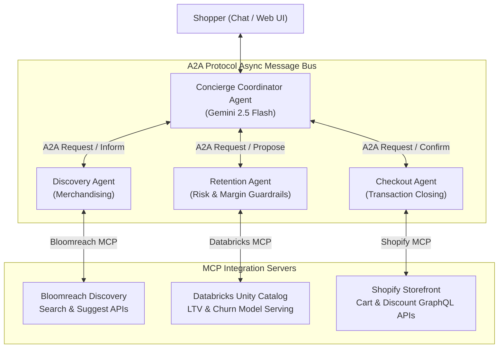

# 🛒 CartFlow Multi-Agent E-Commerce Checkout Engine

[](https.python.org)
[](https://pypi.org/project/google-genai/)
[](#system-architecture)

An end-to-end, multi-agent e-commerce checkout and conversion engine designed to **maximize conversion rates** and **minimize cart abandonment**.

The engine orchestrates four specialized AI agents using the **Google GenAI SDK (`google-genai`)**, the **Agent-to-Agent (A2A)** JSON message protocol, and the **Model Context Protocol (MCP)** across **Bloomreach Discovery**, **Databricks**, and **Shopify**.

---

## 🏛️ System Architecture



---

## 🤖 Specialized Agents

1. **Concierge Coordinator Agent (`concierge_agent.py`)**:
   - Primary conversational interface using `google-genai` SDK and `gemini-2.5-flash`.
   - Intent classification (`DISCOVERY`, `HESITATION`, `CHECKOUT`).
   - Multi-agent workflow synthesis and conversion-focused response generation.

2. **Discovery Agent (`discovery_agent.py`)**:
   - Specialized Merchandising Agent connected to Bloomreach MCP server.
   - Vector search, autocomplete, and inventory availability lookup.

3. **Retention Agent (`retention_agent.py`)**:
   - Risk & dynamic discount engine connected to Databricks MCP server.
   - Evaluates real-time churn score and enforces margin safety caps (`max_authorized_discount_pct`).

4. **Checkout Agent (`checkout_agent.py`)**:
   - Transaction closing agent connected to Shopify MCP server.
   - Mutates carts via Storefront GraphQL API and generates 1-click discounted checkout links.

---

## 📨 Agent-to-Agent (A2A) Protocol Specification

Communication between agents follows a strict Pydantic JSON envelope:

```json
{
  "message_id": "msg_984f2a1102cd",
  "conversation_id": "conv_8892ab10",
  "sender": "concierge",
  "receiver": "retention",
  "timestamp": "2026-09-25T16:15:00Z",
  "performative": "REQUEST",
  "content": "Customer hesitating on price ($180.00). Evaluate churn risk and discount cap.",
  "task": {
    "task_id": "task_44a1b029",
    "goal": "Evaluate Churn & Dynamic Discount",
    "customer_id": "cust_101",
    "metadata": {
      "hesitation_detected": true,
      "cart_value": 180.0
    }
  },
  "artifacts": {}
}
```

### Performatives Supported:
- `REQUEST`: Solicit action or evaluation from another agent.
- `INFORM`: Return verified data or search results.
- `PROPOSE`: Offer dynamic discount or cart configuration.
- `CONFIRM`: Verify 1-click cart creation and return checkout URL.
- `FAILURE`: Signal execution or integration error.

---

## 📦 Project Structure

```text
checkout_agents/
├── README.md                   # Architecture & documentation
├── pyproject.toml              # Dependencies & pytest configuration
├── .env.example                # Environment variables template
├── src/
│   ├── __init__.py
│   ├── protocols/
│   │   ├── __init__.py
│   │   └── a2a_schema.py       # Pydantic models for A2AMessage, TaskRequest, Artifacts
│   ├── mcp_servers/
│   │   ├── __init__.py
│   │   ├── bloomreach_server.py # MCP server wrapping Discovery Search & Suggest APIs
│   │   ├── databricks_server.py # MCP server wrapping Unity Catalog / SQL / Model Serving
│   │   └── shopify_server.py    # MCP server wrapping Storefront & Cart GraphQL APIs
│   ├── agents/
│   │   ├── __init__.py
│   │   ├── concierge_agent.py   # Primary conversational coordinator using gemini-2.5-flash
│   │   ├── discovery_agent.py   # Merchandising agent connected to Bloomreach & Shopify inventory
│   │   ├── retention_agent.py   # Risk & dynamic discount engine connected to Databricks
│   │   └── checkout_agent.py    # Transaction closing agent generating 1-click cart links
│   └── orchestrator.py          # A2A async bus coordinating tasks across the agents
└── tests/
    └── test_end_to_end.py       # Full pipeline test with simulated customer flow
```

---

## ⚡ Quickstart & Testing

### 1. Environment Setup
Copy `.env.example` to `.env` and set API credentials (or run in `USE_MOCKS=true` mode for zero-cost offline development):

```bash
cp .env.example .env
```

### 2. Run Test Suite
Execute the end-to-end multi-agent test pipeline using `pytest`:

```bash
pytest checkout_agents/tests/test_end_to_end.py -v
```

---

## 🛠️ Tech Stack

- **AI SDK**: `google-genai` (Gemini 2.5 Flash)
- **Protocol Layer**: Model Context Protocol (`mcp`), Pydantic v2
- **Networking**: `httpx` async HTTP client
- **Testing**: `pytest`, `pytest-asyncio`
